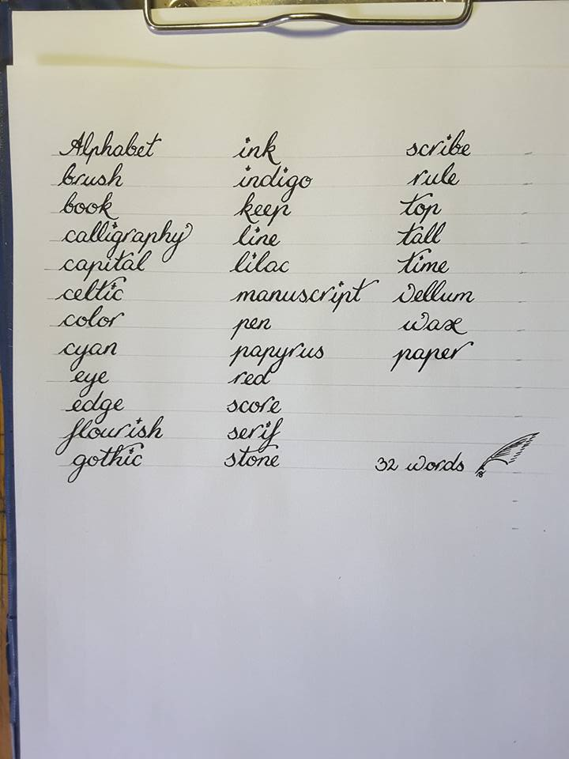

http://e-library.iep.edu.gr/iep/collection/browse/index.html

https://www.iampeth.com/home

https://www.datagen.gr/index.php?option=scripts&script=crossword

Text-to-speech,
 Improve the Ancient Polytonic Greek ISO Android/IOS,
 http://www.passport.gov.gr/elot-743.html  (μεταγραφή των Ελληνικών χαρακτήρων σε Λατινικούς σύμφωνα με το πρότυπο ΕΛΟΤ 743 (που είναι ταυτόσημο με το Διεθνές Πρότυπο ISO 843 https://en.wikipedia.org/wiki/ISO_843 ) 
Phonemic chart,
transliteration (letter-mapping) or transcription (sound-mapping), 
Apostolos Garoufos, MinaDot - a computer program which automatically transcribes books into Braille. You input the Greek or English text and it gives you the transcription (in Braille). Easy, plain, and without having to know Braille. It can make thousands of transcriptions in seconds
http://www.polytoniko.org/erga.php?newlang=el&font=Palatino+Linotype&right=no#0  , https://www.lexigram.gr/logismika.htm , 
http://arxaia.gr/chapter/view/999001/video , 
http://www.biblionet.gr (Ετυμολογία, Αδίδακτα Αρχαία Ελληνικά κείμενα), 
Comparison of speech synthesizers, Euphonia (device), Association for Computational Linguistics (ACL), 
Ετυμόλεξο
https://quizlet.com/Omnick

**Digital Braille** 

Eleni Vamvakari: Wow!  Do you realise that this literally means every word of every chapter of every book?  Unless, of course, i just need a tiny section.  Anyway, you're amazing!  I personally use a program called EZAccent, which is much easier than the microsoft keyboard.  I would love to know, though, if Tesseract can be modified.  it is open source. I know that G Image Reader works with it.  Sometimes, it translates nicely.

These are the relevant programs that I either use or have tried using.

Here is the Wikipedia entry on Tesseract.  It provides some background on the software, and the official link to their website can also be found here.

https://en.wikipedia.org/wiki/Tesseract_(software) 

Here are two pages for G Image Reader.  One is for downloads and the other is for development.

https://sourceforge.net/projects/gimagereader/ 
https://sourceforge.net/projects/gimagereader/files/0.9/ 

Here is the screen reader that I use.

http://www.nvaccess.org 

I actually use an older version,  (2017.3, available under Download) which implements things slightly differently. I like this version of espeak (the synthesizer that I use) better than the new one.

To give you some background, this is the Wikipedia page on espeak.

https://en.wikipedia.org/wiki/ESpeakNG 

This is the page for espeak itself.  This version is a bit different from the one found in NVDA.  Regardless of which one is used, it can handle most symbols in polytonic, but a small number have not been implemented yet.  I was the one who wrote to the developers to include polytonic.  prior to that, support for it didn't exist at all for many years!

https://github.com/espeak-ng/espeak-ng/ 

This is the Wikipedia page on ABBYY FineReader.  This is the only program in the list which is commercial and closed source.  That's why I hesitated in adding it.  But it can be trained to recognise polytonic, and doing so is fully legal.  It just takes an incredible amount of time, unless things have changed over the last few years.

https://en.wikipedia.org/wiki/ABBYY_FineReader 

This is unrelated to anything, but since you're studying html, you may find it interesting.  It relates to creating webpages that are accessible to the blind.  There are several such sites on the Internet.

http://www.afb.org/info/programs-and-services/afb-consulting-services/afb-accessibility-resources/123 

https://webdesign.tutsplus.com/articles/accessibility-basics-designing-for-visual-impairment--cms-27634 

Παντόγραμμα ονομάζεται μια πρόταση στην οποία χρησιμοποιούνται όλα τα γράμματα ενός αλφαβήτου, τουλάχιστον από μία φορά το καθένα. Τα παντογράμματα είναι συνήθως διαφορετικά όχι μόνο για κάθε αλφάβητο, αλλά συχνά και για κάθε γλώσσα και χρησιμοποιούνται κυρίως στην τυπογραφία για την ανάδειξη των διαφορετικών γλύφων μιας γραμματοσειράς, καθώς επίσης και παλαιότερα για την ανάπτυξη της καλλιγραφίας ή/και δακτυλογράφησης.

Παράδειγμα: "The quick brown fox jumps over the lazy dog" (περιέχει και τα 26 γράμματα του λατινικού αλφαβήτου).

Pangram (Greek: παν γράμμα, pan gramma, "every letter") or holoalphabetic sentence is a sentence using every letter of a given alphabet at least once. Pangrams have been used to display typefaces, test equipment, and develop skills in handwriting, calligraphy, and keyboarding.

The best-known English pangram is "The quick brown fox jumps over the lazy dog".

Panalphabetic Window is a stretch of text that contains all the letters of the alphabet in order. It is a special type of pangram or pangrammatic window.

Natural-sounding panalphabetic sentences are not particularly difficult to construct; the following sequence of 132 letters by Howard Bergerson is often quoted:[1][2][3]

Well, about porn, I can say definitely that although I loathe junk like that myself, I don't propose to question other people's right to it, because, in my view, if sexy magazines and X-rated movies are what they want instead of the real thing, more power to them!

Μετατροπή Greek σε Greeklish

Κατοπτρική γραφή / Mirror writing

Καρκινικές επιγραφές ή καρκίνοι ονομάζονται συμμετρικές φράσεις οι οποίες μπορούν να διαβαστούν είτε από την αρχή είτε από το τέλος.

Palindrome is a word, number, phrase, or other sequence of characters which reads the same backward as forward, such as madam or racecar or the number 10801. Sentence-length palindromes may be written when allowances are made for adjustments to capital letters, punctuation, and word dividers, such as "A man, a plan, a canal, Panama!", "Was it a car or a cat I saw?" or "No 'x' in Nixon".

Scrabble Word Finder Greek & English

Η επισεσυρμένη γραφή (Μονοκοντυλιά) είναι σύμφωνα με την ελληνική παλαιογραφία ο γενικός γραφικός χαρακτήρας των χειρογράφων στον οποίον είναι γραμμένα διάφορα κείμενα της καθημερινής γραπτής επικοινωνίας. Συναντάται σε όλες τις περιόδους της ελληνικής χειρόγραφης γραφής και είναι, μαζί με την φιλολογική γραφή των βιβλίων, το ένα από τα δύο βασικά είδη γραφής που χρησιμοποιούνται παράλληλα. Η επισεσυρμένη γραφή ήταν γενικά πιο αποδοτική αφού περιόριζε την ανάγκη του γραφέα να σηκώνει συνεχώς τη πένα και του επέτρεπε να γράφει πιο γρήγορα. Έτσι η επισεσυρμένη γραφή ήταν απαραίτητη σε χρονοβόρες διαδικασίες όπως η αντιγραφή χειρογράφων και κειμένων κατά τον Μεσαίωνα.

Το όνομα της γραφής συναντάται ήδη στους Εταιρικούς διαλόγους του Λουκιανού, όπου διαβάζουμε το εξής: «τα γράμματα ου πάνυ σαφώς, αλλά επισεσυρμένα δηλούντα έπειξίν τινά του γεγραφόντος.»

Agamemnon Tselikas: 

Μαθήματα παλαιογραφίας
Το Ιστορικό και Παλαιογραφικό Αρχείο (ΙΠΑ), εκτός από το κύριο έργο του εμπλουτισμού της φιλμοθήκης του με τη μικροφωτογράφηση χειρογράφων και αρχείων από βιβλιοθήκες της Ελλάδας και του εξωτερικού, οργανώνει ειδικά Μαθήματα ελληνικής παλαιογραφίας για όσους επιθυμούν να εξοικειωθούν με την ανάγνωση παλαιών ελληνικών χειρογράφων.

Τα μαθήματα γίνονται στην έδρα του Ιστορικού και Παλαιογραφικού Αρχείου (Π. Σκουζέ 3, Αθήνα) κάθε Πέμπτη (5.00‒9.00 μ.μ.), αποτελούνται από τρεις κύκλους και αρχίζουν τον Οκτώβριο κάθε έτους.

Διδάσκει ο Προϊστάμενος του ΙΠΑ Αγαμέμνων Τσελίκας.

Πληροφορίες στο τηλέφωνο: 210 3221 337

Ταχυδρομική Διεύθυνση: Π. Σκουζέ 3, Αθήνα 105 60

E-mail: 

